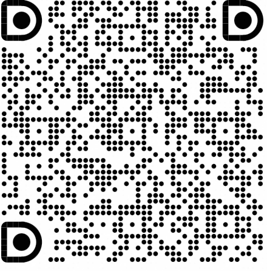
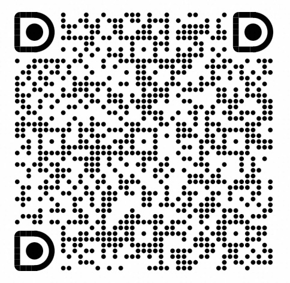
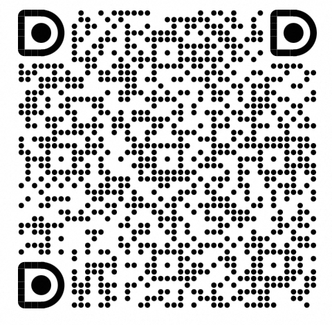

# LoongSuite GenAI Semantic Conventions

LoongSuite GenAI Semantic Conventions is an **open-source GenAI semantic conventions repository from Alibaba** that provides enhanced Generative AI observability standards, building upon the foundation of [OpenTelemetry GenAI Semantic Conventions](https://github.com/open-telemetry/semantic-conventions-genai).

## Key Features

- **GenAI-Focused**: Specialized semantic conventions for LLM applications, model interactions, and AI service observability
- **Production-Tested**: Based on real-world experience from Alibaba's internal AI infrastructure
- **OTel-Compatible**: Built on OpenTelemetry standards, ensuring seamless integration with the OTel ecosystem
- **Community-Driven**: Open-sourced to benefit the broader GenAI observability community

## Documentation

The human-readable version of the semantic conventions resides in the [docs](docs/README.md) folder. These Markdown documents are generated from the YAML definitions located in the [model](model/README.md) folder, following the OpenTelemetry Semantic Conventions toolchain approach.

## Version Compatibility

LoongSuite release `v1.40.0` is based on
[OpenTelemetry Semantic Conventions v1.40.0](https://github.com/open-telemetry/semantic-conventions/releases/tag/v1.40.0)
at commit [`7fe5373`](https://github.com/open-telemetry/semantic-conventions/commit/7fe537301d17919af7d7eb65b32e9be35da2c497).
It includes additional LoongSuite GenAI conventions and is not identical to
the OpenTelemetry release.

## Contributing

We welcome contributions from the community! Whether you're adding new GenAI conventions, improving documentation, or fixing issues, your input is valuable.

See [CONTRIBUTING.md](CONTRIBUTING.md) for detailed guidelines on:

- How to propose new semantic conventions
- Code of conduct
- Development workflow
- Testing and validation requirements

## Acknowledgments

This project builds upon the excellent work of the [OpenTelemetry GenAI Semantic Conventions](https://github.com/open-telemetry/semantic-conventions-genai) project and the broader OpenTelemetry community. We are grateful for their foundational contributions to observability standardization.

## Community

We are looking forward to your feedback and suggestions. You can join
our [DingTalk group](https://qr.dingtalk.com/action/joingroup?code=v1,k1,mexukXI88tZ1uiuLYkKhdaETUx/K59ncyFFFG5Voe9s=&_dt_no_comment=1&origin=11?) or scan the QR code below to engage with us.

| GenAI SemConv SIG | Python SIG | Java SIG | Go SIG |
| --- | --- | --- | --- |
|  |  |  |  |

## Resources

* AgentScope: <https://github.com/modelscope/agentscope>
* Observability Community: <https://observability.cn>

## License

This project is licensed under the [Apache License 2.0](LICENSE)
